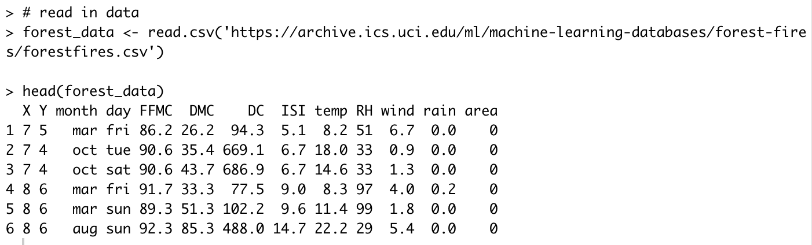

# Forest Fire Analysis

November, 2018                               
Davy Guo and Jim Pushor    

#### Project Summary

The purpose of the project was to explore a data set featuring forest fires in a national park of Portugal. We decided on an inferential question: **Do fires that begin on weekends burn more area on average than fires that begin on weekdays?**.

Among 13 related attributes in the data. Many of these attributes we assume to be obviously associated with the size of the burnt area (wind speed or ambient temperature), but what about an attribute that might not be so obviously associated with the size of the forest that burns? Would the day of the week that a fire starts have any bearing on the average size of the burnt area? Sometimes resources available in public services are more scarce on weekends versus weekdays, and this might contribute to larger fires that start on the weekend compared to weekdays.

We have already determined a fixed value of alpha to 0.05 to represent a threshold of significance for rejection of the null hypothesis. To provide the context of our analysis, a small set of sample data with the difference of means between the two groups can be produced along with the high and low confidence intervals. Additionally, we can provide a p-value and a plot (i.e. null hypothesis distribution) with the confidence intervals and test statistic overlaid clearly to assist with our supporting our conclusion from our data. To aid in communicating our conclusion, the null hypothesis distribution may be represented with a histogram or kernel density plot along with visually representing where our observed test statistic and confidence intervals sit.

#### Data Set Identification
After reviewing several datasets, we have chosen the ["Forest Fire Data Set" from the UCI Machine Learning Repository](https://archive.ics.uci.edu/ml/datasets/Forest+Fires).




#### Dependencies
R 3.5.1
R Libraries

* tidyverse 1.2.1

* infer 0.3.1

* ggbeeswarm 0.6.0

* knitr 1.20

#### Usage

To process the analysis, we could run the following commandlines, or simply run the shell script "run_all.sh":

```
# load and clean data, inputfile: forestfires.csv, outputfile: cleaned_forestfires.csv
Rscript scripts/clean_data.R data/forestfires.csv data/cleaned_forestfires.csv

# plot exploratory visualization, inputfile: cleaned_forestfires.csv, outputfile: EDA.png
Rscript scripts/visualize_data.R data/cleaned_forestfires.csv img/EDA.png

# analyze data, inputfile: cleaned_forestfires.csv, outputfile: null_distribution_two_means.csv
Rscript scripts/analyze_data.R data/cleaned_forestfires.csv data/null_distribution_two_means.csv

# create plot and results, inputfile: cleaned_forestfires.csv, outputfile: result.png
Rscript scripts/result.R data/cleaned_forestfires.csv img/result.png

# make report
Rscript -e "rmarkdown::render(''./reports/report.Rmd','github_document')"
```

#### Repository Structure

```
project_root/
├── reports/
│   ├── report.Rmd
│   ├── report.md
├── scripts/
│   ├── forest_data.R
│   ├── clean_data.R
│   ├── analyze_data.R
│   ├── visualize_data.R
│   ├── result.R
├── data/
│   ├── FFCSample.csv
│   ├── FFC_data.csv
│   ├── FFRSample.csv
│   ├── Summarized_Data.csv
│   ├── cleaned_forestfires.csv
│   ├── forestfires.csv
│   ├── null_distribution_two_means.csv
├── img/
│   ├── EDA.png
│   ├── Estimation_and_CI_Plot.png
│   ├── Result.png
│   ├── script_ex.png
│   ├── EDA.png
├── README.md
├── .gitignore
├── run_all.sh
├── makefile
```

#### Docker Image

Docker provides a convenient method to package our entire analysis application, dependencies and all, so anyone can reproduce our work on their local computer. A user can run the entire the "Forest Fire Analysis", just like we did, and be confident that the Docker container contains everything they need to reproduce the work. Follow the steps below to reproduce our analysis:

**Step 1:** Clone/download this repository and create a local repository.

**Step 2:** Use the command line to navigate to the root of this project on your computer, and then type the following (filling in PATH_ON_YOUR_COMPUTER with the absolute path to the root of this project on your computer).

docker run --rm -e PASSWORD=1234 -v <PATH_ON_YOUR_COMPUTER>:/DSCI_522_Forest_Fire_Analysis davyguo/dsci_522_forest_fire_analysis  make -C '/DSCI_522_Forest_Fire_Analysis' all

To clean up the analysis type:

docker run --rm -e PASSWORD=1234 -v <PATH_ON_YOUR_COMPUTER>:/DSCI_522_Forest_Fire_Analysis davyguo/dsci_522_forest_fire_analysis make -C '/DSCI_522_Forest_Fire_Analysis' clean

**Step 3:**

#### Final Report

The report will be found through link below:

https://github.com/UBC-MDS/DSCI_522_Forest_Fire_Analysis/blob/master/reports/Report.md
