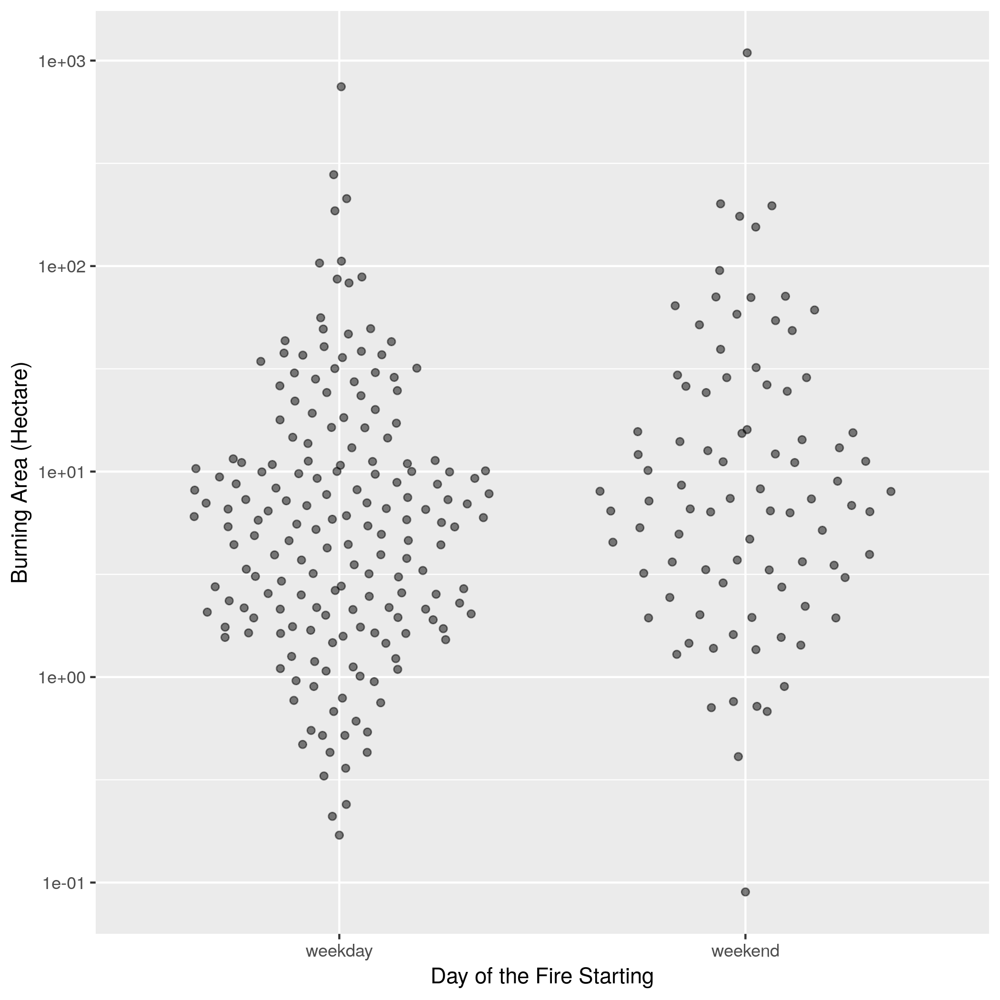
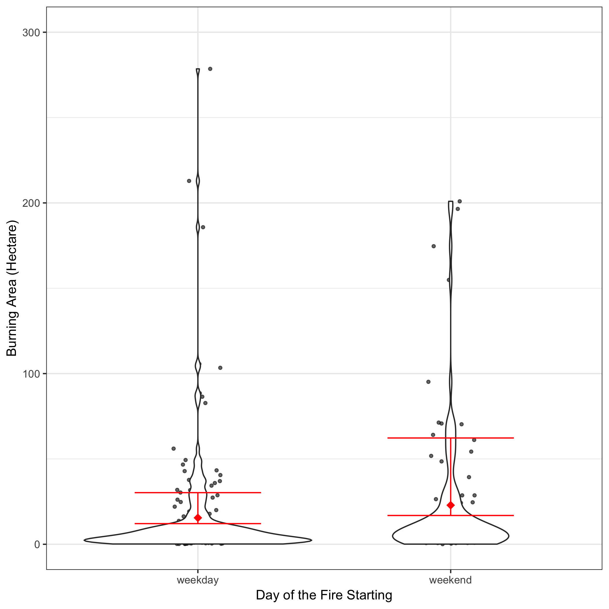
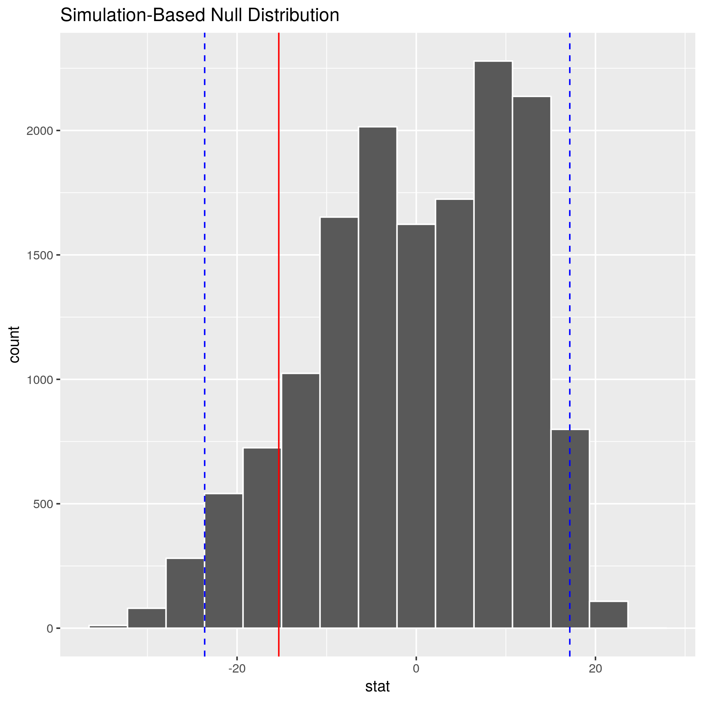

# Report
```{r setup, include=FALSE}
knitr::opts_chunk$set(echo = TRUE)
```

## Introduction

The purpose of the project was to explore a data set featuring forest fires in a national park of Portugal. We decided on an inferential question: **Do fires that begin on weekends burn more area on average than fires that begin on weekdays?** This question was spun out of exploring the raw data set table (Table 1).

```{r, echo FALSE}
library(knitr)
FFR_data <- read.csv("../data/FFRSample.csv")
FFC_data <- read.csv("../data/FFCSample.csv")
FFS_data <- read.csv("../data/Summarized_Data.csv")
```
The raw data set below included many features that are typical to forest fire analysis; however, considering question criteria outlined in *The Art of Data Science* By Roger Peng and Elizabeth Matsui, we chose a question that may not have been answered from this data.

*Table 1. Forest Fire Raw Dataset Sample*
```{r, echo = FALSE}
kable(head(FFR_data))
```

**Feature Descriptions in Raw Dataset**   

   1. X - x-axis spatial coordinate within the Montesinho park map: 1 to 9
   2. Y - y-axis spatial coordinate within the Montesinho park map: 2 to 9
   3. month - month of the year: "jan" to "dec" 
   4. day - day of the week: "mon" to "sun"
   5. FFMC - FFMC index from the FWI system: 18.7 to 96.20. Fine Fuel Moisture Code (FFMC) of the Fire Weather Index (FWI) is a an indexing of the moisure content of litter and other cured fine fuels.
   6. DMC - DMC index from the FWI system: 1.1 to 291.3. Duff Moisture Code (FFMC) of the Fire Weather Index (FWI) is an indexing of the moisure content of loosely compacted organic layers of moderate depth.
   7. DC - DC index from the FWI system: 7.9 to 860.6. Drought Code (DC) of the Fire Weather Index (FWI) is an indexing of the moisure content of deep, compact organic layers.
   8. ISI - ISI index from the FWI system: 0.0 to 56.10. Initial Spread Index (ISI) is a numeric rating of the expected rate of fire spread.
   9. temp - temperature in Celsius degrees: 2.2 to 33.30
   10. RH - relative humidity in %: 15.0 to 100
   11. wind - wind speed in km/h: 0.40 to 9.40 
   12. rain - outside rain in mm/m2 : 0.0 to 6.4 
   13. area - the burned area of the forest (in ha): 0.00 to 1090.84 - skewed toward 0.00.
   

**Data Wrangling and Production of Subset of Data**   
Prior to doing further analysis, we needed to perform some data cleaning and wrangling. Using `Table 1` we removed any of the rows where the burnt area was zero. A zero value indicated an extremely small or neglibable burn area, which could skew our results. We wanted to focus on the the fire events that resulted in measurable burnt area.

In addition to removing zero valued rows for area burned. We classified the days of the week into two groups. One group, `Weekday` included all the weekdays and the other group, `Weekend` included all the weekend days.


*Table 2. Subset of Forest Fire **Clean** Dataset Sample*
```{r, echo = FALSE}
kable(head(FFC_data))
```


## Visualization (EDA)

We explored our clean data by creating a distribution plot to compare the fire events on a weekend to a weekday. Our general observation was that they were similarly distributed relative to burnt area. Most of the fire event observations, at first glance, appear to cluster around the the same size of fire regardless of the category of day (weekday or weekend day). There are more observations occuring in the weekday category, but we are assuming this is because there are more weekdays than weekend days.

*Figure 1. Distribution Plot of Forest Fires Weekday vs. Weekend Days*




## Analysis

Through repeated simulations, we completed a difference in means null hypothesis test to determine if there was enough evidence to reject our null hypothesis: There is no difference in mean size of fire between the two groups: fires that start on a weekday vs. fires that start on a weekend day.

We produced a data summation table with lower and upper confidence intervals and the means of the two groups. *The difference of means of the observed data was 15.34 hectares*

*Table 3. Data Summary Statistics Showing 95% Confidence Intervals and Mean Values of Area Burnt (hectares)*
```{r, echo = FALSE}
kable(head(FFS_data))
```


The following violin plot shows the distribution of the fires with the above confidence intervals and means noted for each group. The weekend group shows a larger range for the confidence intervals which suggests greater variation of values, as well as, a consequence of the effect of a relatively smaller data set.

*Figure 2. Distribution Plot of Size of Burnt Area by Day Type*   
*95% Confidence Intervals and Means Shown in Red*




**Hypothesis Testing**
*The null hypothesis:* There is no difference in the mean of burnt area based on a fire starting on a weekday vs a weekend day.   

In order to test our null hypothesis, we performed 15,000 simulated sample draws from our sample data and constructed a sampling distribution.  visualized our observed difference in means between the two groups compared to the null hypothesis distribution. The resulting histogram shows that our observed value is inside the range of our 95% confidence intervals. With a pvalue of 0.158, and the alpha set at 0.05, there is not enough evidence to reject the null hypothesis that the two means are different.

*Figure 3. Histogram of Null Hypothesis Distribution with Observed Diff of Means Value in Red &*
*95% Confidence Intervals in Blue*



## Conclusion

The difference in means null hypothesis test produced not enough evidence to reject the null hypothesis. We can say that given the null hypothesis is true, the probability of us seeing a similar observation of at least or greater extreme is likely enough (~16%) for us to not dismiss the null hypothesis statement. 

#### Critique and Future Steps

On reflection, there are a few things to consider:   

Though we are testing the difference of means of a subpopulation of a feature, it may be more appropriate to do muliple regression testing to understand how the different features impact the response variable: burnt area. It would be interesting to determine which features contribute to more of the variation of the area burnt than others. Also, because we can use linear regression analysis to observe both independent feature influence and the interaction of variables we should improve our understanding of how fire size is influenced. Therefore, It is difficult to conclude from our analysis and method that the day of the week has an impact on the size of the fire, independently, considering our method of analysis. On the other hand, the purpose of this project was only to determine if there is enough evidence to say that in the true population the mean size burnt is different on a weekday vs a weekend day. We did not find the significant evidence required.   

Secondly, one of our initial points of curiousity was whether the availability of resources on a weekend vs a weekday might influence the area burnt. In order for us to explore this assumption, we would require operational data from the forest fire management services, which we do not have. This would be another feature group to consider in building a model or performing regression analysis to understand whether this operational explanatory variable influences fire size. Also, we would have to substantiate whether we have statistical significance to make that determination.  

Lastly, We do not know the priority of fighting these fires in the park. It may be the case that fire fighting is triaged based on risk to public safety, versus risk of area burned. what is the goal of managing the fires? The approach to fighting fires is dependent on policies and mandates of governments and managing entities. We assumed that because this was in a national park, that the approach would be homogenious versus if the fire was in private lands or close to urban settings.    

We are satisfied that we chose to keep the "dimensions" of this project to a minimum, so to not distract us from the goal of understanding data science workflows.

**References**

[UCI Machine Learning Data Sets](https://archive.ics.uci.edu/ml/datasets/Forest+Fires)   
Peng, Roger and Elizabeth Matsui. "The Art of Data Science: A Guide for Anyone Who Works with Data" Leanpub. 2018.   
[Canadian Wildfire Fire Information](http://cwfis.cfs.nrcan.gc.ca/background/summary/fwi)


